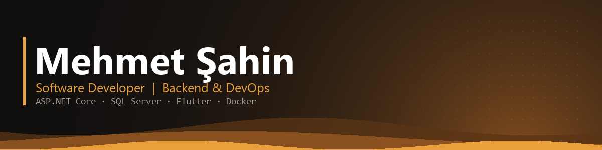

  
  

---

<table>
  <tr>
    <td valign="top" width="58%">
      <h2>Hakkımda</h2>
      
Erciyes Üniversitesi Bilgisayar Mühendisliği mezunuyum. Ağırlıklı olarak <b>backend geliştirme</b> ve <b>deployment</b> süreçleri üzerine çalışıyorum; odağım, geliştirilen sistemin canlıya alındıktan sonra da kararlı biçimde çalışması.

      
Optimizasyon ve karar verme gerektiren problemlerde <b>makine öğrenmesi</b> ve <b>bilgisayarlı görü</b> yaklaşımlarından da yararlanıyorum.

      <ul>
        <li>ASP.NET Core ile ölçeklenebilir web platformları</li>
        <li>Flutter ve React Native ile çapraz platform mobil geliştirme</li>
        <li>Python tabanlı makine öğrenmesi ve görüntü işleme çalışmaları</li>
        <li>Clean Architecture, SOLID ve IIS üzerinde canlı ortam yönetimi</li>
      </ul>
    </td>
    <td valign="top" width="42%">
      
    </td>
  </tr>
</table>

---

## Teknolojiler

   
  

| | |
|---|---|
| **Backend** | C# · ASP.NET Core · Entity Framework Core · Blazor · Django · REST API |
| **Mobil & Web** | Flutter · Dart · React · React Native · Bootstrap |
| **Yapay Zekâ & Veri** | Python · Scikit-learn · Pandas · YOLO (Computer Vision) |
| **Mimari** | Clean Architecture · SOLID · OOP |
| **Veritabanı & Araçlar** | MS SQL Server · PostgreSQL · Git · IIS Deployment · Docker · Postman |

---

## Deneyim

| | |
|---|---|
| **Albatros Savunma ve Güvenlik** — Yazılım Mühendisliği Stajyeri | Yaz 2026 |
| **Merkür Savunma Teknolojileri A.Ş.** — Makine Öğrenmesi Stajyeri | Yaz 2025 |

---

## Öne Çıkan Projeler

<table>
  <tr>
    <td width="50%" valign="top">
      <h3><a href="https://github.com/Mhmtshn6/GEP">GEP</a></h3>
      
Çevresel engelleri tespit etmek için özel bir hibrit veri setiyle eğitilmiş, <b>gerçek zamanlı bilgisayarlı görü</b> sistemi. Nesne çıkarımı FastAPI backend'i üzerinden yapılır; React Native istemci tespit edilen nesneyi, konumunu ve tahmini mesafesini Türkçe sesli yönlendirme olarak aktarır.

      

        
        
        
        
      

    </td>
    <td width="50%" valign="top">
      <h3><a href="https://github.com/Mhmtshn6/Website-Template">Website-Template</a></h3>
      
Kurumsal <b>web sitesi ve yönetim paneli</b> şablonu. Ürün, kategori, galeri, proje ve iletişim formu yönetimi; öncesi/sonrası proje karşılaştırmaları ve yapılandırılmış SEO desteği içerir. Gerçek bir müşteri projesinin, hassas veriler çıkarılmış portfolyo sürümüdür.

      

        
        
        
        
      

    </td>
  </tr>
</table>
